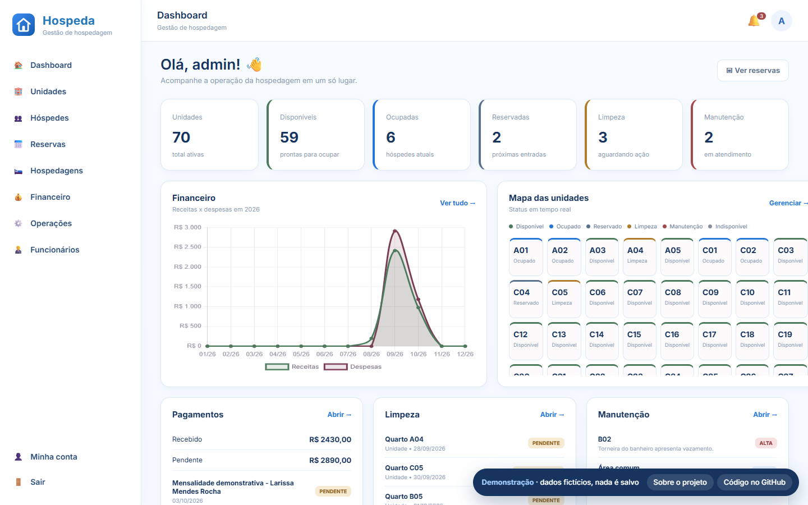
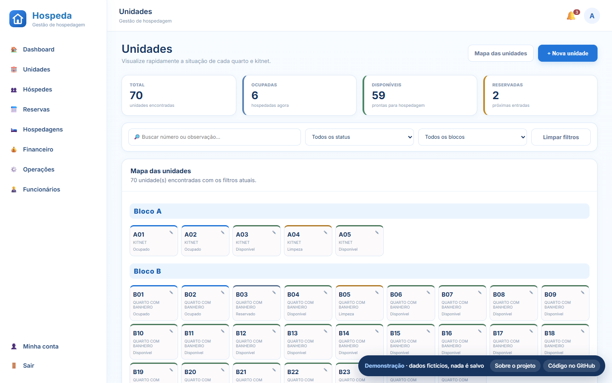
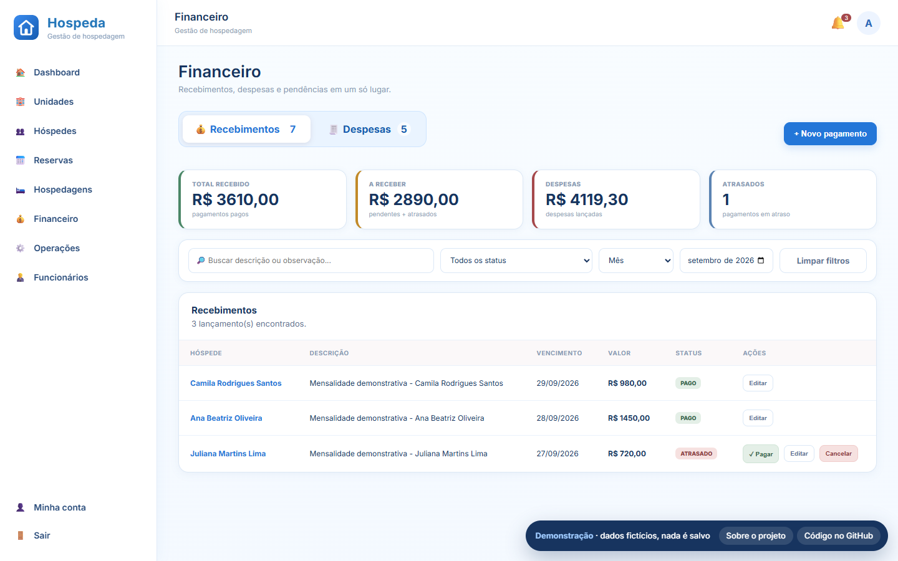

<div align="center">


# Hospeda — Sistema de gestão de hospedagem

Sistema web para casas de hospedagem, pensionatos e residências: unidades, hóspedes, reservas, financeiro, limpeza e manutenção em um só painel.

**[▶ Abrir a demonstração interativa](https://vitoriamir.github.io/hospeda-web/)**




</div>

## Recursos

| Módulo | O que faz |
|---|---|
| **Dashboard** | Ocupação, receitas × despesas do ano, pagamentos, limpezas e chamados em aberto |
| **Unidades** | Mapa visual por bloco com status (disponível, ocupado, reservado, limpeza, manutenção) e preços por tipo de unidade |
| **Hóspedes** | Cadastro completo, vínculo com a unidade e histórico de estadias |
| **Reservas e hospedagens** | Entrada, saída, check-out e reservas por período |
| **Calendário** | Reservas e hospedagens no calendário, com arrastar e soltar para remarcar |
| **Financeiro** | Pagamentos e despesas, atraso automático após o vencimento, filtros por período |
| **Operações** | Agenda de limpeza e chamados de manutenção com prioridade e custo |
| **Funcionários** | Equipe, criação de acesso ao sistema, permissões e redefinição de senha |
| **Notificações** | Alertas de pagamentos atrasados, limpezas pendentes e manutenção |

<table>
<tr>
<td></td>
<td></td>
</tr>
</table>

## Demonstração online

A demo no GitHub Pages é gerada a partir da própria aplicação: o script [scripts/build_demo.py](scripts/build_demo.py) renderiza todas as telas com uma base de dados fictícia e publica as páginas como HTML estático. Os formulários mostram um aviso em vez de gravar, e buscas/filtros funcionam localmente no navegador.

O workflow [.github/workflows/pages.yml](.github/workflows/pages.yml) refaz a demo a cada push na `master` e toda segunda-feira (para as datas fictícias acompanharem o calendário).

## Rodando localmente

Requer Python 3.11+ (3.12+ para gerar a demo estática).

```powershell
python -m venv .venv
.venv\Scripts\Activate.ps1          # Linux/macOS: source .venv/bin/activate
pip install -r requirements-web.txt
python run_web.py
```

Abra http://127.0.0.1:5000 e entre com `admin` / `admin123` (o sistema pede a troca de senha no primeiro acesso).

Na primeira execução é criada a base `conpec.db` com uma massa de dados fictícia (nomes, CPFs e contatos de teste) em todos os módulos.

Para gerar a demo estática localmente:

```powershell
python scripts/build_demo.py _site
python -m http.server -d _site 8000
```

## Personalizando a marca

Nome, subtítulo, cidade e logo vêm de um arquivo local `brand.local.json` (fora do git) ou de variáveis de ambiente, que têm prioridade:

```json
{
  "name": "Minha Hospedagem",
  "tagline": "Gestão de hospedagem",
  "location": "Cidade – UF",
  "logo": "img/brand/logo.png"
}
```

Copie [brand.example.json](brand.example.json) para `brand.local.json` e coloque o logo em `static/img/brand/` (também fora do git). Variáveis equivalentes: `BRAND_NAME`, `BRAND_TAGLINE`, `BRAND_LOCATION`, `BRAND_LOGO`.

Outras variáveis:

| Variável | Uso |
|---|---|
| `CONPEC_SECRET_KEY` | Chave de sessão do Flask. Sem ela, uma chave é gerada e salva em `.secret_key` |
| `CONPEC_DATABASE_URL` | Base de dados alternativa (padrão: `sqlite:///conpec.db`) |

## Estrutura

```
app/
  core/        segurança (hash PBKDF2) e marca configurável
  database/    engine SQLAlchemy e migrações leves do SQLite
  models/      modelos de dados
  services/    carga inicial e massa de dados fictícia
templates/     telas (Jinja2)
static/        CSS, JS e imagens
demo/          landing page e scripts exclusivos da demo estática
scripts/       geração da demo para o GitHub Pages
run_web.py     aplicação Flask e rotas
```

---

Desenvolvido por [@VitoriaMir](https://github.com/VitoriaMir). Todos os dados exibidos na demonstração são fictícios.
